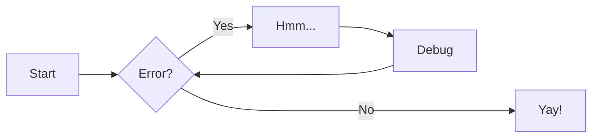

# Computational thinking

Computational thinking is a way of approaching problems that is useful in computing

## Computational Techniques:

There are several computational techniques:

 * [Pattern Matching](./#pattern-matching)
 * [Abstraction](./#abstraction)
 * [Decomposition](./#decomposition)

### Pattern Matching
This entails identifying patterns and recognising when two patterns are similar,
When two patterns are similar we can more often than not use the same solution for both.
The more patterns we can find the easier and quicker we will be at solving the problem.

### Abstraction
This means removing all unnecessary information about the problem so that only the relevant easpects remain
It helps reduce the problem to it's essential features and lead to a slolution that is simpler, more efficient and faster to implement.

*example:*

The prompt() function in javascript, you understand what it does and how to use it
but you don't need to know what happens to the arguments you pass into it, just what the result will be,
these details are abstracted away.

### Decomposition  
This is breaking down tasks into a set of smaller and more manageable tasks.

## Algorithms
An algorithm os a specific set of step-by-step rules for solving a problem or completing a task.
Each step must be so precisely defines that it can be translated into a programming language and executed by a machine.

Algorithms must conform to the following:

 * Have definiteness: each step must be precisely defined and be unambiguous. Computers cannot guess or rely on prior experience so every detail must be accounted for
 * Have one or more inputs and outputs
 * Be finite: must consist of a finite number of steps and terminate.
 * Have ceffectiveness: Alloperations to be performed must be sufficiently basic that they can be done esxactly and in finite length.
 * Have a clear flow  of control from beginning to end

Common elements of algorithms include:
 * Data input,
 * Computation
 * Sequence
 * Iteration
 * And a means to report the output

**Sequence:**

The order in which the instructions occur and are processed

**Selection:**

Determines which path the program takes when it is running

**Iteration:**

Is the repeated execution of a section of code when a program is running

Advantages of algorithms:
 * Easy to understand
 * An algorithm has a definite procedure
 * It is not dependent on any progremming language
 * Every step in an algorithm has its own logical sequence so it is easy to debug.

Ways of describing algorithms:
 * Natural language: Write out or verbally express a list of steps
 * Flowcharts: draw each step and show the flow of control
 * Psuedocode: a mix of programming language and everyday language to describe instructions less formally than using a programming language
 * Using maths.

# Flowcharts

flowcharts are an excellent way of communicating the logic of a program, they are easy and efficient to analyse the problems 

However they are difficult to draw for large/complex programs, if changes are made the  flowchart will need to be redrawn.

Rules for creating flowcharts:

 * Flowcharts must have a start and an end

*All The symbols in a flowchart:*

*A simple flowchart for if statements:*

*A simple flowchart for if-else statements:*

*A simple flowchart for if-elif-elif-else statements:*

