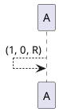

# Turing Machines

## Introduction

The Turing Machine was invented in 1936 by Alan Turing.
It is a basic abstract symbol-manipulating device that can be use to simulate the logic of any computer that could possibly be constructed.

Although it was never actually constructed by Turing, its theory yeilded many insights.

A real life implementation of a turing machine:

Anything that can be done on a modern computer could be done on a Turing machine

## Components of a turing machine:

1. An infinitely long tape made up of individual cells. Each cell can contain a single character - typically 1, 0 or B

2. A read/write head is pointed at an individual cell

3. A controler (aka finite-state machine) will instruct the read/write head

## Turing Machines - Operation

Initially the tape is inscribed with a sequence of characters - called the input

The operation of the turing machine is controlled by the finite state machne (controller)
The operation takes place as a sequence of streps known as transitions

The controller decides for a given (input character, state) par, the (output character, state) pair - known as a transition.

Each transition involves:
 * Reading.
 * Writing.
 * Moving.
 * Updating

Transistions can be expressed using:

State transition tables:
| Current state | Read (input) | write (output) | Direction to move | Next State |
|---------------|--------------|----------------|-------------------|------------|
| S1            | 1            | 0              | Right             | S1         |

Or using state transition diagrams:

Turing machines - sates

At any given time, A turing machine is said to be in a particular state. States are usually denoted by the letterS followed by a number e.g. S2 is taken to mean state two
S0 is conventionally used to denote the initial state. This is the state the TM is in before it starts to operate.

A double circle s used to denote the final or halting state. This is the state the TM is in when it finishes

## Turing machines -- Significance

Computability is defined as a task that can be carried out by a turing machine
