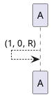

# Turing Machines

## Introduction

The Turing Machine was invented in 1936 by Alan Turing.
It is a basic abstract symbol-manipulating device that can be use to simulate the logic of any computer that could possibly be constructed.

Although it was never actually constructed by Turing, its theory yeilded many insights.

A real life implementation of a turing machine:

Anything that can be done on a modern computer could be done on a Turing machine

## Components of a turing machine:

1. An infinitely long tape made up of individual cells. Each cell can contain a single character - typically 1, 0 or B

2. A read/write head is pointed at an individual cell

3. A controler (aka finite-state machine) will instruct the read/write head

## Turing Machines - Operation

Initially the tape is inscribed with a sequence of characters - called the input

The operation of the turing machine is controlled by the finite state machne (controller)
The operation takes place as a sequence of streps known as transitions

The controller decides for a given (input character, state) par, the (output character, state) pair - known as a transition.

Each transition involves:
 * Reading.
 * Writing.
 * Moving.
 * Updating

Transistions can be expressed using:

State transition tables:
| Current state | Read (input) | write (output) | Direction to move | Next State |
|---------------|--------------|----------------|-------------------|------------|
| S1            | 1            | 0              | Right             | S1         |

Or using state transition diagrams:

Turing machines - sates

At any given time, A turing machine is said to be in a particular state. States are usually denoted by the letterS followed by a number e.g. S2 is taken to mean state two
S0 is conventionally used to denote the initial state. This is the state the TM is in before it starts to operate.

A double circle s used to denote the final or halting state. This is the state the TM is in when it finishes

## Turing machines -- Significance

Computability is defined as a task that can be carried out by a turing machine

## 1940
Alan turing developed the Bombe machine to break the encryption of the enigma machine
both were specific purpose machines

## Collosus
World's first programmable electronic digita l computer
used for WW2 code breaking

Created in 1943 in the UK
Could not store programs in memory, just data
Had to be rebuilt using cables and switches every time a new program was needed. Not considered general purpose as it was soley used for code breaking

## ENIAC (Electronic Numerical Integrator and Computer)
American Programmable computer considered the first general purpos digital computer. Similar to collosus it needed to be rebuilt too reprogram it

Kay McNulty was one of the first programmers of the ENIAC
Betty Jean Jennings and Fra  Bilas were also female ENIAC programmers

Both the Collossus and the ENIAC used punch cards and vacuum tubes and did not store the programs in memory

The colossus was binary with (0,1) and the ENIAC was decimal {0, 1, 2, 3, 4, 5, 6, 7, 8, 9}

## 1947

The transistor was invented in Bell labs in the USA.
The device can act as a switch, turning tiny electric currents on or off and also as an amplifier of electric current.
Logic gates which allow us too build circuits for boolean algebra are made primarily of transistors as memory components and CPUS.

The logic gates which allow us too build boolean algebra circuits were built out of transistors

## The invention of high-level programming languages
In the early days of computing electronic computers could only be programmed by numbers, tape, punch cards or even manually manipulating thermionic valves (vacuum tubes) to certain settings

After WW2 Grace Hopper worked on the first commercial computer called the UNIVAC
Universal Automatic Computer, A stored Program Computer, it used magnetic tape instead of punch cads, it was a decimal computer that used vacuum tubes.

In 1953 she invented the first high level programming language, A-0 that used words and expressions to program the UNIVAC. She also created the first modern day compiler and coined the phrase bug. A-0 evolved into Flow-matrix which became COBOL
